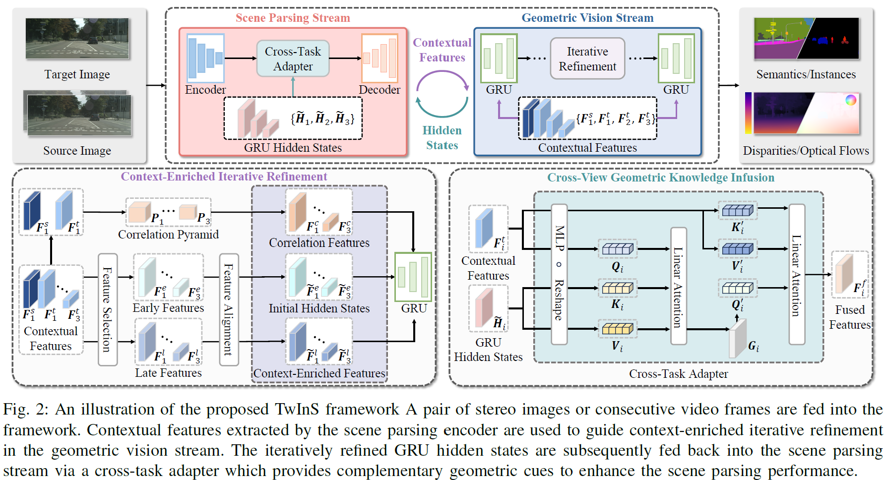
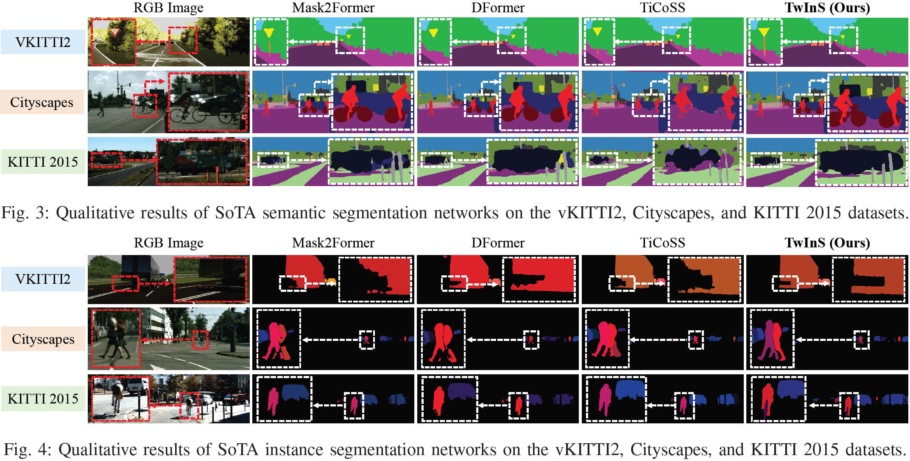

# TwInS: Two-Stream Interactive Joint Learning for Scene Parsing and Geometric Vision

### [**Paper**](https://arxiv.org/abs/2602.13588)

This is the official implementation for [TwlnS](https://arxiv.org/abs/2602.13588): https://arxiv.org/abs/2602.13588

## 📋 Overview
TwInS explores the interaction between **scene parsing** and **geometric vision** tasks, including semantic segmentation, instance segmentation, stereo matching, and optical flow.  
The goal is to improve task performance by enabling **bidirectional interaction** between semantic context and geometric correspondence.

  
*Two-stream interactive framework overview.*

## 🎯 Motivation
Traditional multi-task learning approaches often share a single encoder across tasks or rely on unidirectional feedback, which limits cross-task information exchange.  
TwInS introduces a **two-stream interactive framework** to enable mutual guidance between tasks, improving both semantic and geometric perception.

## 🛠 Method
- **Scene Parsing Stream:** Extracts semantic context and instance-level features to guide geometric predictions.  
- **Geometric Vision Stream:** Predicts stereo and optical flow correspondences, providing iterative refinement for scene parsing.  
- **Cross-Task Adapter:** Bridges hidden states from the geometric stream to the parsing stream to enhance feature fusion and task interaction.

## 📊 Results
- **Semantic Segmentation:** Up to **7.23% mIoU improvement** on Cityscapes, vKITTI2, and KITTI 2015 datasets.  
- **Instance Segmentation:** Up to **13.64% mAP improvement**, demonstrating effective cross-task feature fusion.  
- **Visualization Analysis:** Qualitative results show enhanced object boundaries and improved correspondence between tasks.  
- **Cross-Task Adapter Validation:** Experiments confirm the adapter effectively strengthens interaction between streams.

  
*Example visual results showing improved segmentation and alignment with geometric features.*

## Notes on Code Availability
The full code is under internal collaboration review.  

## Keywords
Multi-task Learning · Scene Parsing · Semantic Segmentation · Instance Segmentation · Geometric Vision · Stereo Matching · Optical Flow
